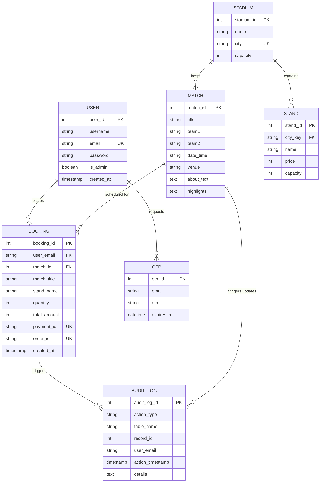

# Enhanced Entity-Relationship (EER) Diagram

This document contains the structural design of the IPL Ticket Management System database, visualizing how users, matches, venues, and bookings interact.

## Visual Representation (Mermaid)

## Entity Descriptions

### 1. USER
- **user_id**: Unique identifier for each account.
- **is_admin**: Boolean flag allowing access to revenue analytics and global booking oversight.

### 2. MATCH
- **match_id**: Primary key for match fixtures.
- **venue**: Linked logically to `STADIUM.name`.

### 3. STADIUM & STAND
- **stadium_id**: Primary key for venues.
- **stand_id**: Primary key for seating sections.
- **city_key**: Links stands to a stadium via its city (e.g., 'Bangalore').

### 4. BOOKING
- **booking_id**: Primary key for each transaction.
- **match_id**: Foreign key linking the purchase to a specific game.
- **user_email**: Foreign key linking the purchase to an account.

### 5. AUDIT_LOG
- **audit_log_id**: Primary key for system logs.
- **record_id**: Generic reference to the ID of the affected row (in `matches` or `bookings`).

### 6. OTP
- **otp_id**: Primary key for temporary verification codes.
