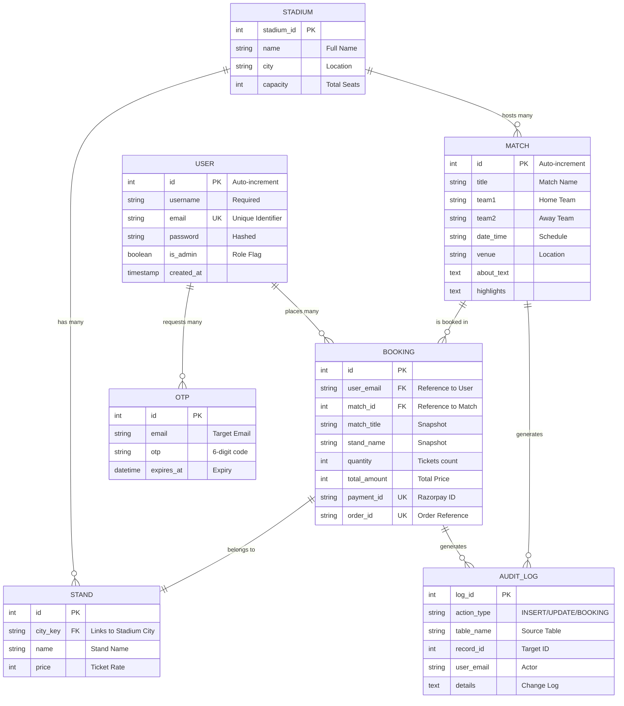

# IPL Ticket Management System - Project Report

## 1. Intro
The **IPL Ticket Management System** is a comprehensive full-stack web application designed to streamline the process of booking tickets for Indian Premier League (IPL) matches. It provides a seamless experience for cricket fans to browse upcoming matches, view detailed information about venues and teams, select specific stands based on pricing, and complete secure transactions. The system integrates modern web technologies with robust database management concepts to ensure data integrity, security, and a premium user experience, while providing comprehensive administrative oversight.

---

## 2. Problem Statement
Traditional ticket booking systems often face challenges such as:
- **Scalability Issues**: Difficulty in handling high traffic during peak booking periods.
- **Data Integrity**: Lack of proper auditing and transactional consistency during seat selection and payment.
- **User Experience**: Cluttered interfaces that make it hard for users to find matches and select seats efficiently.
- **Security**: Vulnerabilities in user authentication and payment processing.
- **Transparency**: Limited visibility for users regarding their booking history and pricing breakdowns (e.g., GST).

The IPL Ticket Management System addresses these by providing a modern, fast, and secure platform with automated auditing and transactional reliability.

---

## 3. System Requirements

### Functional Requirements
1. **User Authentication**: Secure signup and login with password hashing and email-based OTP verification.
2. **Match Browsing**: Display a list of upcoming matches with team details, date, and venue.
3. **Stand Selection**: Users can view different stands available at the stadium with corresponding ticket prices.
4. **Booking & Payment**: Integration with Razorpay for secure payments and a transactional booking process.
5. **Booking History**: Users can view their past bookings with detailed summaries.
6. **Admin Dashboard**: A secure interface for administrators to monitor system performance, analyze revenue, and manage ticket bookings.
7. **Booking Management**: Administrators can view global booking details and delete records to resolve conflicts or handle cancellations.
8. **Audit Logging**: Automatic logging of critical actions like bookings, match updates, and deletions for administrative tracking.

### Non-Functional Requirements
1. **Security**: Use of **BCrypt** for password encryption, **JWT** for session management, and **TCL (Transactions)** for database consistency.
2. **Performance**: High-speed page loads using **Vite** and efficient data fetching via **MySQL Connection Pooling**.
3. **Scalability**: Backend architecture designed to handle concurrent user requests.
4. **Maintainability**: Modular code structure with separated routes, controllers, and database configurations.
5. **Reliability**: Use of stored procedures and triggers to automate backend logic and ensure data consistency.

---

## 4. Backend, Frontend Tools and DB

### Frontend Tools
- **React (v19)**: A modern JavaScript library for building user interfaces.
- **Vite**: A fast build tool and development server.
- **TypeScript**: Adds static typing to JavaScript for better developer productivity and fewer bugs.
- **Vanilla CSS**: Custom-crafted, premium styles using CSS variables and modern layout techniques (Flexbox/Grid).
- **Lucide-React**: For a rich set of modern icons.
- **Axios**: For making HTTP requests to the backend.

### Backend Tools
- **Node.js & Express**: A robust runtime and framework for building scalable APIs.
- **MySQL2**: A fast MySQL driver for Node.js with promise support.
- **Nodemailer**: For sending OTPs and booking confirmations via email.
- **Razorpay SDK**: To handle secure payment transactions.
- **BCrypt.js**: For secure password hashing.
- **JWT (JSON Web Tokens)**: For stateless user authentication.

### Database
- **MySQL**: A reliable relational database management system (RDBMS) used to store users, matches, bookings, and audit logs.

---

## 5. EER (Enhanced Entity-Relationship Diagram)

The Enhanced Entity-Relationship (EER) diagram for the IPL Ticket Management System visualizes the structural design of the database. It captures the entities, their attributes, and the complex relationships that govern the ticketing workflow.

### Visual Representation


### Detailed EER Description

#### 1. Entities and Attributes
- **USER**: The central actor. It stores credentials and unique emails. The `email` acts as a secondary key for authentication and linking bookings.
- **MATCH**: Stores information about scheduled games. It includes descriptive fields like `about_text` and `highlights` for the frontend display.
- **STADIUM & STAND**: Represents the physical venues. A Stadium contains multiple Stands. The `stadiums` table acts as a master reference for all IPL venues (Bangalore, Chennai, Mumbai, etc.), storing names, cities, and capacities. This ensures that match venues are standardized and linked to their respective cities for pricing.
- **BOOKING**: A transactional entity that links a User to a Match and a specific Stand. It captures payment metadata (`payment_id`, `order_id`) to ensure financial traceability.
- **OTP**: A temporary entity used for security. It has a 1-to-many relationship with the user email (a user can request multiple OTPs over time).
- **AUDIT_LOG**: A tracking entity that captures system changes. It is populated via **Database Triggers** and **Stored Procedures**, capturing insertions, updates, and deletions.
- **ADMIN CONTROLS**: While not a separate entity, the `is_admin` flag in the `USER` entity enables access to restricted views and management functionalities.

#### 2. Key Relationships and Cardinality
- **User to Booking (1:N)**: A single user can place multiple bookings over time, but each booking belongs to exactly one user.
- **Match to Booking (1:N)**: A match can have many ticket bookings, but each booking record is specific to one match.
- **Stadium to Match (1:N)**: One stadium can host multiple matches throughout the season.
- **Stadium to Stand (1:N)**: Each stadium is partitioned into several stands (e.g., Executive Lounge, Terrace), each with its own price point.
- **Booking to Audit Log (1:N)**: Every successful booking triggers an entry in the audit log via the `sp_process_booking` stored procedure.

#### 3. Constraints and Integrity
- **Primary Keys (PK)**: Every entity has a unique integer ID to ensure record uniqueness.
- **Unique Keys (UK)**: Emails, Payment IDs, and Order IDs are constrained to prevent duplicates and ensure transaction security.
- **Foreign Keys (FK)**: Relationships like `match_id` in `bookings` ensure referential integrity, preventing bookings for non-existent matches.
- **Temporal Tracking**: Most tables include `created_at` or `expires_at` timestamps to manage data lifecycle and auditing.

---

## 6. Relational Model
The database is structured as follows:
- **users** (`id`, `username`, `email`, `password`, `is_admin`, `created_at`)
- **matches** (`id`, `title`, `team1`, `team2`, `date_time`, `venue`, `about_text`, `highlights`)
- **stands** (`id`, `city_key`, `name`, `price`)
- **bookings** (`id`, `user_email`, `match_id`, `match_title`, `stand_name`, `quantity`, `total_amount`, `payment_id`, `order_id`, `created_at`)
- **stadiums** (`stadium_id`, `name`, `city`, `capacity`)
- **otps** (`id`, `email`, `otp`, `expires_at`)
- **audit_log** (`log_id`, `action_type`, `table_name`, `record_id`, `user_email`, `action_timestamp`, `details`)

---

## 7. Normalization
The database follows normalization principles to reduce redundancy:
1. **1NF (First Normal Form)**: All tables have primary keys, and each column contains atomic values.
2. **2NF (Second Normal Form)**: All non-key attributes are fully dependent on the primary key. For example, stand prices are separated from match details into the `stands` table.
3. **3NF (Third Normal Form)**: No transitive dependencies. Stadium information is stored in its own table (`stadiums`), and match records reference the stadium location.
   - *Note: Some data like `match_title` in `bookings` is stored for historical snapshots (denormalization for performance/records).*

---

## 8. Schema
The database schema is initialized automatically upon server startup. Key table definitions include:

```sql
CREATE TABLE users (
    id INT AUTO_INCREMENT PRIMARY KEY,
    username VARCHAR(255) NOT NULL,
    email VARCHAR(255) NOT NULL UNIQUE,
    password VARCHAR(255) NOT NULL,
    is_admin BOOLEAN DEFAULT FALSE,
    created_at TIMESTAMP DEFAULT CURRENT_TIMESTAMP
);

CREATE TABLE matches (
    id INT AUTO_INCREMENT PRIMARY KEY,
    title VARCHAR(255) NOT NULL,
    team1 VARCHAR(255) NOT NULL,
    team2 VARCHAR(255) NOT NULL,
    venue VARCHAR(255) NOT NULL,
    -- ... other fields
);

CREATE TABLE bookings (
    id INT AUTO_INCREMENT PRIMARY KEY,
    user_email VARCHAR(255) NOT NULL,
    match_id INT NOT NULL,
    stand_name VARCHAR(255) NOT NULL,
    quantity INT NOT NULL,
    total_amount INT NOT NULL,
    payment_id VARCHAR(255) NOT NULL,
    -- ... other fields
);
```

---

## 9. Implementation

### Backend & DB Concepts Integration
The project implements advanced SQL concepts to enhance functionality:
- **Stored Procedures**: `sp_process_booking` handles the multi-step process of saving a booking and creating an audit log entry in a single atomic call.
- **Triggers**: 
    - `tr_audit_match_update`: Automatically logs any changes made to match details into the `audit_log` table.
    - `tr_audit_booking_delete`: Ensures that every time a booking is deleted by an admin, a record of the deletion (including actor and match details) is preserved in the audit log.
- **Views**: 
    - `vw_booking_details`: Provides a granular view of every booking, including user info, match info, and stadium details. Used for both user history and administrative auditing.
    - `vw_booking_summary`: An aggregated view showing total bookings, tickets sold, and revenue per match, enabling real-time business intelligence for admins.
- **Functions**: `fn_calculate_gst` is used to dynamically calculate a 18% GST on booking amounts during data retrieval.
- **Transactions (TCL)**: All booking operations use `START TRANSACTION`, `COMMIT`, and `ROLLBACK` to ensure no partial data is saved if a failure occurs.

### Frontend Features
- **Admin Dashboard**: A specialized view for administrators featuring revenue analytics, ticket sales tracking, and global booking management tools.
- **Responsive Logo Grid**: Users can filter matches by clicking on team logos.
- **Date Filtering**: Advanced match filtering allows users and admins to view fixtures scheduled from a specific date onwards.
- **Glassmorphic UI**: High-end aesthetic with blurred backgrounds and vibrant gradients.
- **Dynamic Routing**: Uses React Router for smooth navigation between matches, details, and booking pages.
- **Role-Based Navigation**: The interface dynamically adjusts its navigation tabs based on whether the logged-in user has administrative privileges.

---

## 10. Conclusion
The **IPL Ticket Management System** successfully provides a robust and aesthetically pleasing solution for cricket ticket booking. By leveraging modern technologies like React, Node.js, and MySQL, the system ensures high performance and security. The integration of advanced database concepts like stored procedures, triggers, and transactions makes the backend resilient and auditable, fulfilling the requirements of a professional-grade application.
